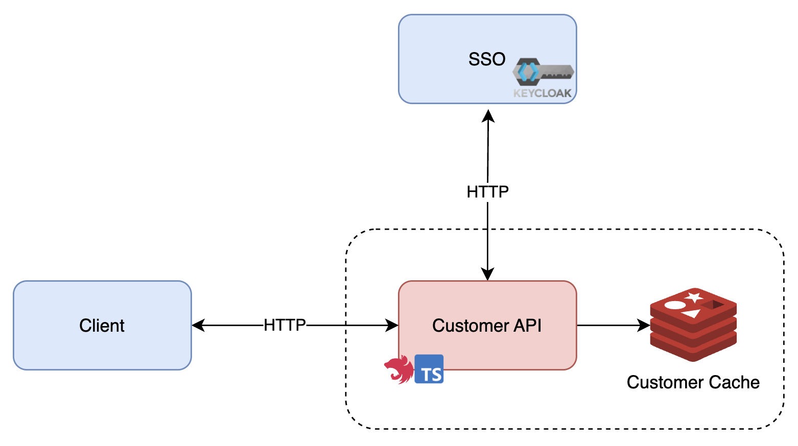

# Stone Customer API

- [Project Overview](#project-overview)
- [Installation](#installation)
  - [Repositories](#repositories)
- [Run locally](#run-locally)
- [Usage](#usage)
- [Features](#features)
- [Technologies Used](#technologies-used)
  - [Architecture Diagram](#architecture-diagram)
- [Author](#author)

## Project Overview

This project is a customer API for Stone challenge. Where the main goal is to allow customers management.

## Installation

### Repositories

- Clone the repository:

```bash
git clone https://github.com/buemura/stone-customer-api.git
```

- After cloned the repository, install all the dependencies using the commands below:

```bash
npm install
```

## Run locally

- Create a `.env.dev` file in the root of the project. You can copy from `.env.example`.

- Run the command below to start redis database and to start the API in development mode:

```bash
npm run docker:up # to start redis
npm run start:dev # to start the API in dev mode
```

## Run in production

- Create a `.env.prod` file in the root of the project. You can copy from `.env.example` and change the `REDIS_HOST` as below if using a redis on a local container:

```bash
# For Windows/Mac
REDIS_HOST = "host.docker.internal"
# For Linux
REDIS_HOST = "172.17.0.1"
```

- Run the command below to start redis database and to start the API in production mode:

```bash
npm run docker:up # to start redis
docker build -t <image_name> . # to build the API docker image
docker run -d -p 8080:8080 --name <container_name> --rm <image_name> # to run the API docker image
docker logs -f <image_name> # to show the API logs
```

## Usage

- After the API is up and running, go to your browser and access the URL `http://127.0.0.1:8080/docs` to see the Swagger API Documentation.

## Features

- As an user you can create a new customer.
- As an user you can update a customer by its Id.
- As an user you get a customer details by its Id.

## Technologies Used

- NodeJS
- NestJS
- Axios
- TypeScript
- Redis

### Architecture Diagram



## Author

Bruno Hideki Uemrua

- [LinkedIn](https://www.linkedin.com/in/bruno-uemura/)
